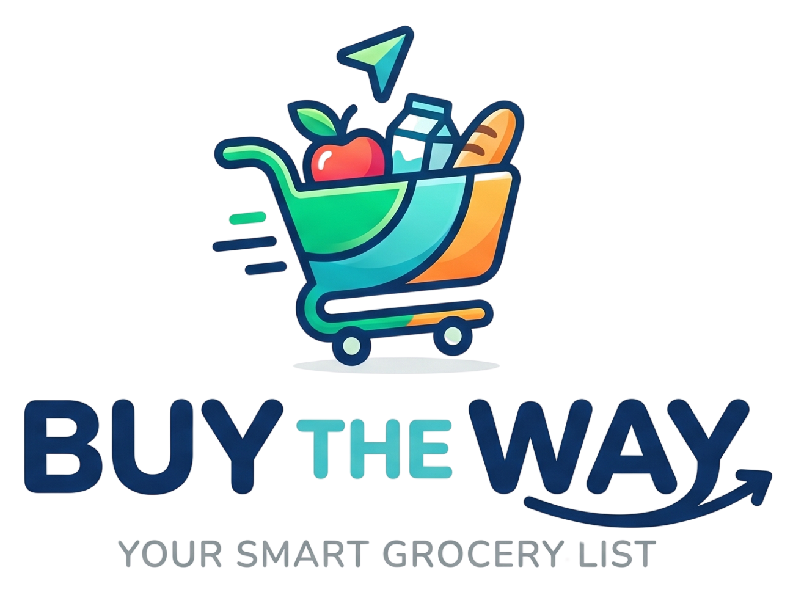

<p align="center">
  
</p>

<p align="center">
  <em>Mobile-first PWA for real-time shared shopping lists. Built for couples and flatmates.</em>
</p>

<p align="center">
  <a href="https://github.com/DanieleBelfiore/buy-the-way/actions/workflows/ci.yml"></a>
  <a href="https://github.com/DanieleBelfiore/buy-the-way/actions/workflows/deploy.yml"></a>
  
  
  
  
</p>

<p align="center">
  <a href="https://buy-the-way.danielebelfiore.dev" target="_blank">Live Web App</a>
</p>

---

## Why

Sharing a grocery list with someone usually means three things: a half-erased note on the fridge, a chat thread full of "did you buy milk?", or yet another generic todo app. Buy The Way is built around three calls only — **add an item**, **check it off**, **share the list** — and stays out of your way otherwise.

The whole UX is tuned for one-handed use at 375 px, in a supermarket, on cellular.

---

## Features

### Core
- **Real-time sync** via Firestore — edits propagate to collaborators in under one second.
- **Offline-first** — IndexedDB persistence keeps lists readable and editable without a connection; changes flush automatically when back online (last-write-wins).
- **Installable PWA** — add to home screen on iOS and Android; works fullscreen with a service worker, app icons, and offline shell.
- **Google sign-in only** — zero passwords to manage, no Apple sign-in, no email/password.
- **Two languages** — Italian and English, switchable at runtime; every UI string is localized.

### Lists & items
- Create lists with auto-uppercased names; duplicate names blocked per user (case-insensitive).
- Item names also get an auto-capitalized first character on add and edit (shared `capitalizeInitial` helper).
- Each list gets a **random wallpaper** picked from a curated set; admins can change it.
- Add items via inline autocomplete that merges your personal catalog with a built-in public catalog (~200 entries).
- Items are grouped by category, sorted alphabetically (locale-aware), with collapsible sections and a per-category `bought/total` counter.
- **Priority cycle**: tap an item's priority chip to cycle `none → urgent → optional → none`; urgent items float to the top of the list, optional drift to the bottom.
- **Long-press or settings shortcut** on an item opens the edit sheet (name, quantity, note, category, pin to favorites).
- **Custom-item badge**: items not present in the built-in public catalog are flagged with a `UserPlus` icon next to the name and a one-tap "Remove from suggestions" action from the edit sheet (sets `excluded` in the personal catalog).
- **Copy or Move** an item to another list via a bottom-sheet picker.
- **Empty list** clears all items after confirmation; available when the list is non-empty. Custom items remain in the personal catalog so they keep showing up in autocomplete next time.

### Favorites & catalog
- The **Favorites shelf** at the top of each list surfaces your most-used items (recency-weighted ranking with a 14-day half-life) for one-tap re-adding.
- Grouped by category, with a stable order during a session — tapping a favorite does NOT rerank it under your finger.
- Admin-only per-list toggle to hide the shelf.
- Long-press a favorite to exclude it from suggestions; pin items explicitly from item edit.

### Collaboration
- Add collaborators by email (must be a registered user); they see the list immediately and on home with a "new" badge.
- Owners can rename, change wallpaper, toggle favorites, remove collaborators, and hard-delete the list (irreversible, items purged).
- Collaborators can leave a list themselves.
- **Account deletion cascade**: when a user deletes their account, owned **solo** lists are hard-deleted, owned **shared** lists transfer ownership to the next collaborator, and lists where the user is just a guest are auto-left. Then the catalog, user profile, and Firebase Auth identity are removed.

### Stats
- A dedicated `/stats` page with **totals cards** (lists, unique collaborators, catalog entries, favorites, total purchases), a **bar chart** of top 10 most-used items, and a **donut chart** of category distribution. All computed client-side from the catalog — zero extra reads.

### Public pages & SEO
- Public routes — `/about`, `/privacy`, `/terms`, `/login` — reachable without authentication and not blocked for signed-in users either. Auth-bypass list lives in `src/router/meta.ts`.
- `/about` renders a hero + features + 10-entry FAQ block, with `WebApplication` and `FAQPage` JSON-LD for rich results.
- `/privacy` (9 sections) and `/terms` (6 sections), hand-written bilingual content split into `src/i18n/locales/legal.{it,en}.json` and merged at i18n init.
- Per-route SEO via `@unhead/vue` + `useDocumentHead({titleKey, descriptionKey})` — `<title>`, `<meta description>`, `<html lang>`, OG + Twitter tags update reactively on locale change.
- `public/robots.txt` allows public routes only and exposes `Sitemap: /sitemap.xml`.

### Polish
- Hero-logo bounce-in animation on `LoginView` and `ListsView` via `@vueuse/motion` — respects `prefers-reduced-motion`.
- Lottie celebrations: `success.lottie` plays once when a list is fully bought; `empty.lottie` and `cart_empty.lottie` animate empty states.
- Haptic tick (10 ms vibrate) on add / check / remove on supported devices.
- Skeleton loaders, slide-out animation on remove, auto-collapse when all items in a category are checked.
- Update prompt when a new service worker is available.

### Privacy & data
- Only data collected: Google account email + displayName + last login, list/item content you create, catalog usage counts. No analytics, no tracking pixels.
- **Sentry error monitoring** in production only (`@sentry/vue`, guarded by `import.meta.env.PROD && VITE_SENTRY_DSN`). All input + text masked in session replays; offline / popup-closed errors filtered before they leave the browser. Listed as a sub-processor in the Privacy Policy.
- **Self-service account deletion** (see above) — full GDPR right-to-erasure built into the UI.

---

## Tech stack

| Layer | Choice | Reason |
|---|---|---|
| Framework | Vue 3 + Composition API | Small bundle, ergonomic, strong TS support |
| Language | TypeScript (`strict`) | Catches errors at compile time |
| State | Pinia | Vue-native, no boilerplate |
| Build | Vite | Fast HMR, ESM-first |
| Routing | Vue Router 4 | Hash-free; auth guard on every route |
| Styling | Tailwind CSS + CSS variables | Design tokens in `src/styles/tokens.css` |
| Icons | `@lucide/vue` | Consistent stroke icons across the UI |
| Animation | `@vueuse/motion`, `@lottiefiles/dotlottie-vue` | Hero logo motion + decorative lotties |
| Charts | `chart.js` + `vue-chartjs` | Lazy-loaded only on `/stats` |
| i18n | `vue-i18n` | Locale persisted to localStorage |
| Head / SEO | `@unhead/vue` | Reactive `<title>`/`<meta>`/`<html lang>` per route + locale |
| Error monitoring | `@sentry/vue` | Production-only, masked replays, filtered noise |
| Backend | Firebase Auth + Firestore | Realtime + offline persistence + rules |
| PWA | `vite-plugin-pwa` (Workbox) | Manifest + service worker + offline shell |
| Tests | Vitest + Vue Test Utils + Playwright | Unit + component + E2E + Firestore rules |

---

## Getting started

### Prerequisites
- Node 20+ (Node 22 / 24 also work; the localStorage polyfill in `tests/setup.ts` handles the Node 22+ quirk).
- `pnpm` (recommended): `npm i -g pnpm`.
- Firebase CLI for emulators and deploy: `npm i -g firebase-tools`.

### First-time setup

```bash
git clone https://github.com/DanieleBelfiore/buy-the-way.git
cd buy-the-way
pnpm install
cp .env.example .env.local        # fill in your Firebase web config
pnpm dev                          # starts Vite on http://localhost:5173
```

For local Firebase emulators (recommended for development):

```bash
pnpm firebase:emulators           # Auth + Firestore on default ports
```

Then open the app in a second terminal:

```bash
pnpm dev
```

---

## Scripts

| Script | What it does |
|---|---|
| `pnpm dev` | Vite dev server with HMR |
| `pnpm build` | Type-check, build, generate PWA service worker |
| `pnpm build:analyze` | Build with `rollup-plugin-visualizer` output |
| `pnpm preview` | Serve the production build locally |
| `pnpm typecheck` | `vue-tsc --noEmit` |
| `pnpm test` | Vitest watch mode |
| `pnpm test:run` | Single-shot unit + component tests |
| `pnpm test:coverage` | Coverage report (V8) |
| `pnpm test:e2e` | Playwright against Firebase emulators |
| `pnpm test:e2e:ui` | Playwright with the GUI runner |
| `pnpm test:rules` | Firestore rules tests against the emulator |
| `pnpm lint` / `pnpm lint:fix` | ESLint |
| `pnpm format` | Prettier write |
| `pnpm firebase:emulators` | Start Auth + Firestore emulators |
| `pnpm firebase:deploy:rules` | Deploy `firestore.rules` + `firestore.indexes.json` |

---

## Project structure

```
src/
  components/         # Reusable Vue components, grouped by domain
    list/             # ListCard, CategorySection, ListItemRow, ItemEditSheet, ...
    stats/            # TopItemsChart, CategoryDonut
    ui/               # ConfirmModal, Toast, OfflineBanner, CompletionCelebration, LegalFooter, ...
  composables/        # useAuth, useHaptic, useReducedMotion, useLogoMotion, useDocumentHead, ...
  domain/             # Pure functions + types (no Vue, no Firebase)
    categories.ts     # Category enum, icons, color tokens, migration
    public-catalog.ts # ~200 seeded items (it + en) + isCustomItemName, iconForName
    ranking.ts        # Catalog recency-weighted ranking, 100% covered
    sort.ts           # Locale-aware category + item sorting
    stats.ts          # Top items, category breakdown, totals
    text.ts           # capitalizeInitial helper (used by lists + items services)
    types.ts          # List, Item, CatalogEntry, UserProfile, Locale
    wallpapers.ts     # Wallpaper allow-list + random picker
  i18n/               # vue-i18n + locales/{it,en}.json + locales/legal.{it,en}.json
  router/             # Routes + auth guard + meta.ts (per-route SEO metadata)
  services/           # Firebase wrappers (auth, lists, items, catalog, users) + sentry.ts
  stores/             # Pinia stores (auth, lists, items, catalog)
  styles/             # tokens.css + global.css (global cursor rules)
  views/              # Route-level components (LoginView, ListsView, ListDetailView, ListSettingsView, SettingsView, StatsView, AboutView, PrivacyView, TermsView)
tests/
  rules/              # Firestore security-rule tests (45 against emulator)
  unit/               # Vitest unit + component tests (641)
  e2e/                # Playwright specs (20)
firebase/
  firestore.rules     # Server-side authorization rules
  firestore.indexes.json # Composite index: lists.collaboratorUids array-contains + updatedAt desc
public/
  branding/           # Logos, wordmark, Google G mark
  animations/         # success.lottie, empty.lottie, cart_empty.lottie
  wallpapers/         # 10 list-card backgrounds
  robots.txt          # Allow public routes + Sitemap pointer
  sitemap.xml         # 5 public URLs
tasks/
  plan.md             # Full implementation plan with acceptance criteria
  todo.md             # Phase + task checklist
SPEC.md               # Product spec, scope decisions, success criteria
```

---

## Firebase

The app uses Auth (Google provider only) and Firestore. No Cloud Functions yet. Required environment variables:

```bash
VITE_FIREBASE_API_KEY=
VITE_FIREBASE_AUTH_DOMAIN=
VITE_FIREBASE_PROJECT_ID=
VITE_FIREBASE_STORAGE_BUCKET=
VITE_FIREBASE_MESSAGING_SENDER_ID=
VITE_FIREBASE_APP_ID=

# Optional — Sentry (production builds only)
VITE_SENTRY_DSN=
VITE_RELEASE=
```

See [.env.example](./.env.example) for the full template.

Firestore data model (collections):

| Path | Document |
|---|---|
| `users/{uid}` | `{ uid, email, displayName, lastLoginAt, lastSeenLists? }` |
| `lists/{listId}` | `{ id, name, ownerUid, collaboratorUids[], itemCount?, showFavorites?, wallpaper?, createdAt, updatedAt }` |
| `lists/{listId}/items/{itemId}` | `{ id, listId, name, quantity, category, note, checked, priority?, createdByUid, createdAt, updatedAt }` |
| `catalog/{uid}/entries/{entryId}` | `{ id, ownerUid, name, category, usageCount, lastUsedAt, pinned?, excluded? }` |

Rules summary: any signed-in user can read `users/{uid}` for the email-lookup flow (write only self); list `read`/`write` is gated on collaborator membership; only the owner mutates non-collaborator fields; owner can transfer ownership to an existing collaborator. Catalog entries are strictly per-user.

---

## Deployment

CI/CD via GitHub Actions:

- **CI workflow** runs on every push and PR: lint, typecheck, unit tests, build, Firestore rules tests, E2E suite.
- **Deploy workflow** runs on `main`: builds and deploys to Netlify (`netlify.toml` configures the build command and publish directory).

Firebase rules + indices are deployed from a CI step using a service-account token stored as a repo secret (`FIREBASE_TOKEN`). See `Phase 12` in `tasks/plan.md` for production checklist.

---

## Release process

End-to-end checklist for shipping a new version to production. The CI/CD pipeline above takes over once the tag lands on `main` — these steps cover what you do **before** the push.

### 1. Pre-release gates (run locally on `main`, working tree clean)

```bash
pnpm install                        # in case lockfile changed
pnpm run typecheck                  # vue-tsc --noEmit
pnpm run lint                       # ESLint
pnpm test:run                       # unit + component tests
pnpm test:coverage                  # branches must be ≥ 80%
pnpm test:rules                     # Firestore rules (needs `pnpm firebase:emulators` running)
pnpm test:e2e                       # Playwright + emulators (slow)
```

If any gate fails: fix on a branch, PR, merge, then restart from step 1.

### 2. Bump the version

Use the convenience scripts — they wrap `pnpm version` to add a Conventional Commits message and create an annotated tag in one shot.

```bash
# Pick ONE depending on the kind of changes since the last tag:
pnpm release:patch                  # bug fixes only        → v1.2.3 → v1.2.4
pnpm release:minor                  # new features, backwards-compatible → v1.2.3 → v1.3.0
pnpm release:major                  # breaking changes     → v1.2.3 → v2.0.0
```

What `pnpm release:*` does, atomically:

1. Bumps the `version` field in `package.json` (and `pnpm-lock.yaml` if needed).
2. Creates a commit: `🦄 RELEASE: vX.Y.Z`.
3. Creates an **annotated** Git tag `vX.Y.Z` pointing at that commit.

### 3. Push commit + tag

```bash
git push --follow-tags
```

`--follow-tags` pushes the new commit **and** the annotated tag it created in a single round-trip. Safer than `git push --tags` (which would also push any unrelated local tags).

### 4. CI/CD takes over

GitHub Actions detects the push to `main` and runs:

1. **CI workflow** (`.github/workflows/ci.yml`): lint, typecheck, build, unit tests, rules tests, E2E. Blocks the deploy if anything fails.
2. **Deploy workflow** (`.github/workflows/deploy.yml`): builds the production bundle, runs `vite build`, pushes the `dist/` directory to Netlify, and uploads source maps to Sentry tagged with `VITE_RELEASE=vX.Y.Z`.
3. **Firestore rules step**: if `firebase/firestore.rules` or `firebase/firestore.indexes.json` changed, deploys them with `firebase deploy --only firestore:rules,firestore:indexes` using `FIREBASE_TOKEN`.

Watch the runs at <https://github.com/DanieleBelfiore/buy-the-way/actions>. Typical end-to-end time: 4–6 minutes.

### 5. Verify in production

- Open <https://buy-the-way.danielebelfiore.dev> in a private window (skip stale cache).
- DevTools → Application → check **Service Worker** updated to the new version (visible in the SW URL hash).
- Confirm the floating **"new version available"** prompt fires for already-installed clients within ~30 s.
- Spot-check Sentry → **Releases** → the new `vX.Y.Z` should appear with the uploaded source maps.

### 6. Rollback (if something is on fire)

> Always prefer **rolling forward** with a hotfix. Rollback is destructive; only use it within the first few minutes of a bad release before users have written meaningful data against the new schema.

```bash
# Option A — Netlify "Publish previous deploy" button (UI, instant, recommended)
#   Site → Deploys → click the last green deploy → "Publish deploy"

# Option B — Revert the release commit and ship a follow-up
git revert <hash-of-🦄 RELEASE-commit>
pnpm release:patch                  # ships e.g. vX.Y.(Z+1) with the revert
git push --follow-tags
```

If Firestore rules changed and need rolling back:

```bash
git checkout v<previous-tag> -- firebase/firestore.rules firebase/firestore.indexes.json
pnpm run firebase:deploy:rules
git checkout main -- firebase/firestore.rules firebase/firestore.indexes.json
```

### 7. Hotfix workflow

For an urgent fix that must skip the usual `develop` → `main` cycle:

```bash
git checkout -b hotfix/<short-name> main
# make the fix, commit normally
pnpm test:run && pnpm run typecheck && pnpm run lint
git push -u origin hotfix/<short-name>
# Open a PR targeting main; once merged, immediately:
git checkout main && git pull
pnpm release:patch
git push --follow-tags
```

### Cheat sheet (TL;DR)

```bash
pnpm test:run && pnpm run typecheck && pnpm run lint        # gates
pnpm release:patch                                          # or minor / major
git push --follow-tags                                      # push commit + tag
# → CI builds, deploys to Netlify, uploads source maps to Sentry
```

---

## Contributing

This is a personal project shipped as a portfolio piece. Issues and pull requests welcome — open one before starting large changes.

Local dev rules:

1. Run `pnpm test:run` before pushing.
2. New features need at least unit tests covering the happy path.
3. Domain logic stays pure (no Firebase, no Vue) — see `src/domain/*`.
4. UI changes need a manual 375 px smoke note in the PR description.
5. Never commit secrets, service accounts, or `.env.local`.

---

## License

[MIT](LICENSE).
